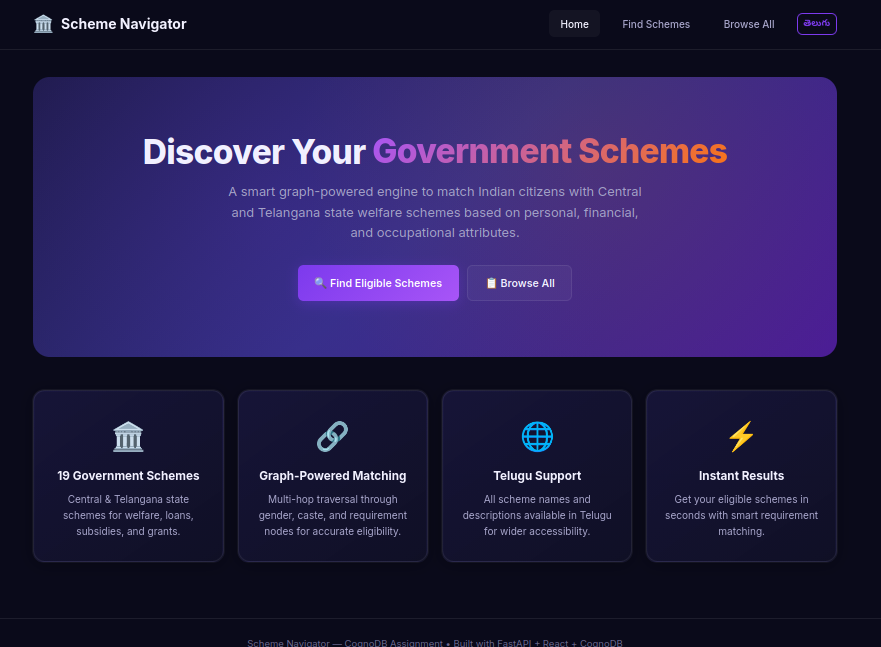
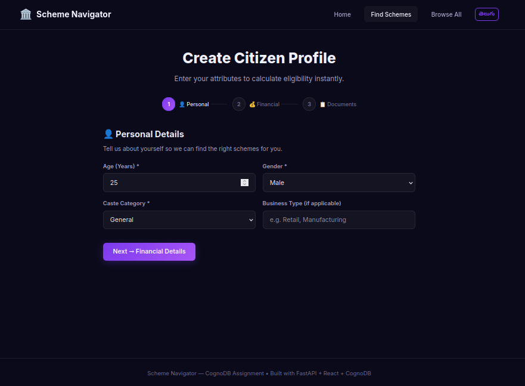
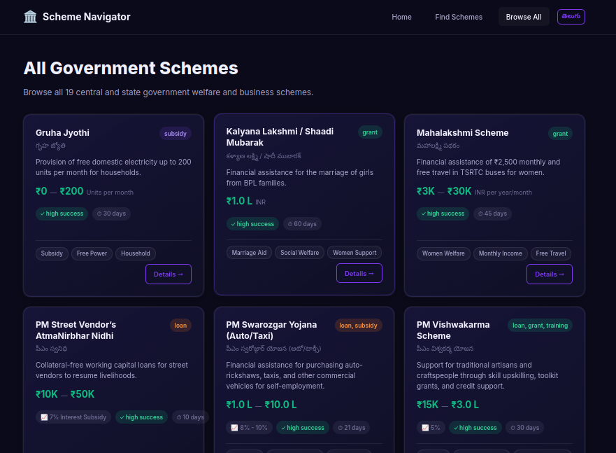
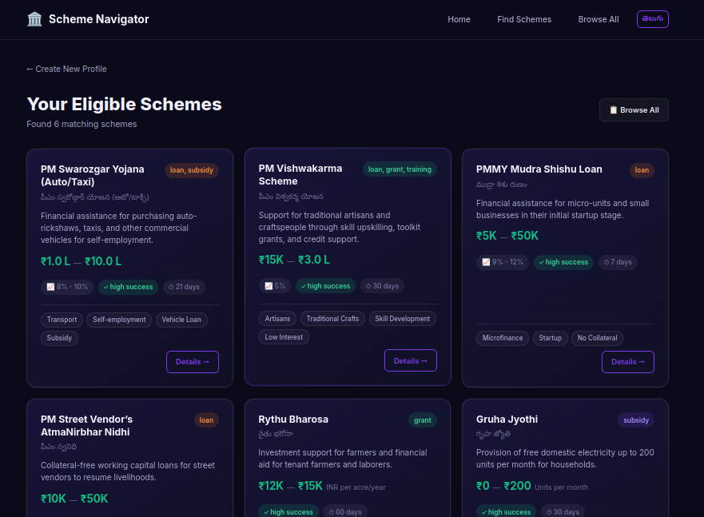
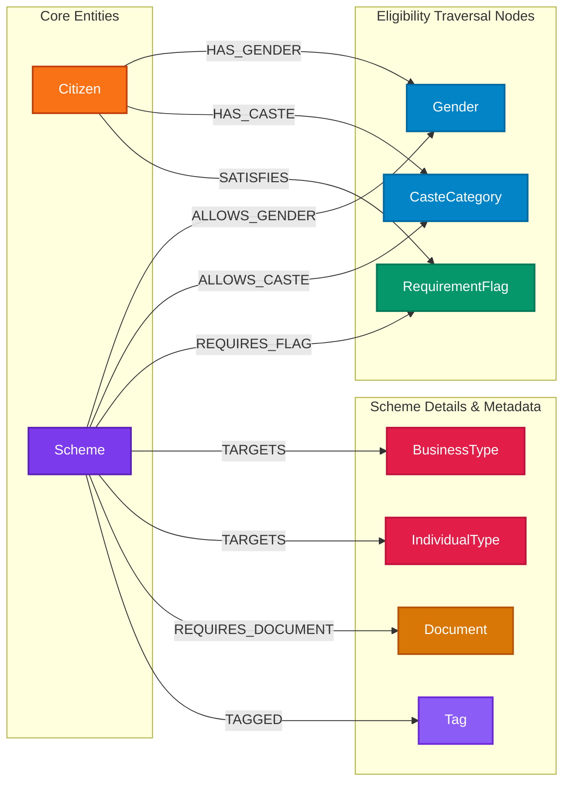

# 🏛️ Scheme Navigator

A full-stack web application that helps Indian citizens discover government welfare and business schemes they're eligible for, powered by a **graph database** (CognoDB / Neo4j-compatible) for multi-hop eligibility matching.

  

---

## 🔗 Mandatory Assignment Deliverables

* 🌐 **Hosted Application Demo (Frontend):** [https://scheme-navigator-ochre.vercel.app](https://scheme-navigator-ochre.vercel.app/)
* ⚡ **Backend API Endpoint (Render):** [https://scheme-navigator-pl4b.onrender.com](https://scheme-navigator-pl4b.onrender.com/health)
* 🎥 **Screen Recording Walkthrough:** [Watch Demo Video (Google Drive)](https://drive.google.com/file/d/1Dy3-_Dg83eK-xSwB090U898xe7cj0pjt/view?usp=sharing)
* 📦 **GitHub Repository:** [https://github.com/Mukthanand21/scheme-navigator](https://github.com/Mukthanand21/scheme-navigator)

---

## 🖼️ Application Screenshots

| 1. Gazette Masthead & Hero Landing | 2. Numbered Citizen Stepper Form |
|---|---|
|  |  |

| 3. Scheme Catalog & Sticky Filter Ribbon | 4. Multi-hop Graph Eligibility Matching |
|---|---|
|  |  |

---

## 📋 Use Case

Government welfare schemes in India have complex, overlapping eligibility criteria — gender restrictions, caste-based reservations, age ranges, income caps, required documents, and prerequisite registrations (GST, bank account, ration card, land ownership). A citizen shouldn't need to manually cross-reference 19+ scheme PDFs.

**Scheme Navigator** lets a citizen fill in their profile once and instantly see every scheme they qualify for — with document requirements, apply links, bilingual Telugu translations, and "you may also qualify for" recommendations.

---

## 🤔 Why a Graph Database?

### The Problem with SQL

In a relational model, eligibility matching requires:
- 6+ JOIN tables (`scheme_genders`, `scheme_castes`, `scheme_requirements`, `scheme_tags`, `scheme_documents`, `citizen_flags`)
- Correlated subqueries for "citizen satisfies ALL required flags" (not just ANY)
- COALESCE/NULL handling across every optional range column
- Self-joins on junction tables for "related schemes"

### The Graph Advantage

In a graph, eligibility is a **traversal**:

```
(Citizen)-[:HAS_GENDER]->(Gender)<-[:ALLOWS_GENDER]-(Scheme)
(Citizen)-[:HAS_CASTE]->(CasteCategory)<-[:ALLOWS_CASTE]-(Scheme)
(Citizen)-[:SATISFIES]->(RequirementFlag)<-[:REQUIRES_FLAG]-(Scheme)
```

One Cypher query walks these three 2-hop paths simultaneously, applies property filters for numeric ranges, and collects documents/tags for display. No JOINs, no subqueries, no impedance mismatch.

---

## 📊 Graph Schema



### Node Counts (after seeding)
| Label | Count | Notes |
|-------|-------|-------|
| Scheme | 19 | Central + Telangana state schemes |
| Gender | 2 | male, female |
| CasteCategory | 7 | sc, st, obc, bc, ebc, general, minority |
| RequirementFlag | 4 | Bank Account, GST Registration, White Ration Card, Land Ownership |
| Tag | 55 | High cardinality — used for similarity |
| Document | ~25 | Deduplicated across schemes |
| BusinessType | ~30 | Target business categories |
| IndividualType | ~8 | Target individual categories |

---

## 🔍 Key Queries

### 1. Eligibility Match (Multi-hop Traversal)

```cypher
MATCH (c:Citizen {id: $citizen_id})
MATCH (c)-[:HAS_GENDER]->(g:Gender)<-[:ALLOWS_GENDER]-(s:Scheme)
MATCH (c)-[:HAS_CASTE]->(cc:CasteCategory)<-[:ALLOWS_CASTE]-(s)
WHERE (s.age_min IS NULL OR s.age_min <= c.age)
  AND (s.age_max IS NULL OR c.age <= s.age_max)
  ...
// + RequirementFlag satisfaction check
// + Document/Tag collection for display
```

**Why it's awkward in SQL:** Requires 6+ JOINs, correlated subqueries for "ALL flags satisfied", and NULL coalescing on every range column.

### 2. Related Schemes (Tag-weighted Similarity)

```cypher
MATCH (s1:Scheme {id: $scheme_id})-[:TAGGED]->(t:Tag)<-[:TAGGED]-(s2:Scheme)
WHERE s1 <> s2
WITH s2, count(DISTINCT t) AS shared_tags
// + optional RequirementFlag overlap (secondary signal)
// weighted score: tags × 3 + flags
```

**Why Tags, not Flags:** Only 4 RequirementFlag values exist (17/19 schemes share "Bank Account"), so flag overlap is near-universal and meaningless. Tags (55 distinct) provide genuine discriminative power.

---

## 🚀 Setup Instructions

### Prerequisites
- Python 3.10+
- Node.js 18+
- A CognoDB Cloud Instance

---

### 1. Create a CognoDB Cloud Instance
Follow these steps to provision a free instance on CognoDB Cloud:
1. **Sign Up:** Go to [console.cognodb.com/signup](https://console.cognodb.com/signup) and create a free account (no credit card required).
2. **Create Instance:** From the CognoDB console dashboard, click **Create Instance**. Choose the free (`c0`) tier and select your preferred deployment region.
3. **Copy Credentials:** Once provisioned (takes under a minute), copy:
   * **Connection URI:** `bolt+s://<instance-id>.databases.cognodb.cloud`
   * **Password:** Generated password for the `cognodb` user (displayed once).
4. **Save Secrets:** Keep these credentials ready to configure in step 2 below.

---

### 2. Clone & Configure Application

```bash
git clone https://github.com/Mukthanand21/scheme-navigator.git
cd scheme-navigator

# Setup Backend Virtual Environment
cd backend
python -m venv .venv
source .venv/bin/activate
pip install -r requirements.txt

# Create .env configuration
cp .env.example .env
```

Edit `backend/.env` with your CognoDB credentials:
```env
NEO4J_URI=bolt+s://<your-instance-id>.databases.cognodb.cloud
NEO4J_USER=cognodb
NEO4J_PASSWORD=<your-generated-password>
```

---

### 3. Seed the Graph Database

```bash
cd backend
python -m app.seed
```

*Note: The seeder script is idempotent (uses Cypher `MERGE`) and safe to execute multiple times.*

---

### 4. Start Backend Server

```bash
cd backend
uvicorn app.main:app --reload --port 8000
```
Backend API will run at `http://localhost:8000` (interactive Swagger documentation available at `/docs`).

---

### 5. Start Frontend Development Server

```bash
cd frontend
npm install
npm run dev
```
Open `http://localhost:5173` in your browser.

---

## 📁 Project Structure

```
scheme-navigator/
├── backend/
│   ├── app/
│   │   ├── config.py      # Env var loading (pydantic-settings)
│   │   ├── db.py           # Neo4j driver wrapper & health checks
│   │   ├── seed.py         # Idempotent graph seeder
│   │   ├── queries.py      # Parameterized Cypher queries
│   │   ├── models.py       # Pydantic request/response models
│   │   └── main.py         # FastAPI routes
│   ├── schemes.json        # 19 scheme seed data
│   └── requirements.txt
├── frontend/               # Vite + React 18 + TypeScript
│   └── src/
│       ├── api/client.ts   # Typed API client
│       ├── components/     # SchemeCard, CitizenForm, etc.
│       ├── pages/          # Home, Profile, Results, Schemes
│       └── types/index.ts  # TypeScript interfaces
├── .gitignore              # Excludes .env
└── README.md
```

---

## 🔐 Security

- All credentials read from environment variables via `python-dotenv` + `pydantic-settings`
- `.env` is gitignored — never committed to version control
- All Cypher queries use driver parameterization — zero string concatenation
- CORS middleware configured safely

---

## 🌐 API Endpoints

| Method | Path | Description |
|--------|------|-------------|
| `GET` | `/health` | Health check (API + DB status) |
| `POST` | `/citizens` | Create citizen profile |
| `GET` | `/citizens/{id}/eligible-schemes` | Find eligible schemes (multi-hop traversal) |
| `GET` | `/schemes` | List all schemes |
| `GET` | `/schemes/{id}` | Scheme detail |
| `GET` | `/schemes/{id}/related` | Tag-weighted related schemes |

---

## 📝 License & Submission Info

Built for the Wexa AI / CognoDB Take-Home Assignment.  
Submitted by **Mukthanand** (`hr@wexa.ai`).
